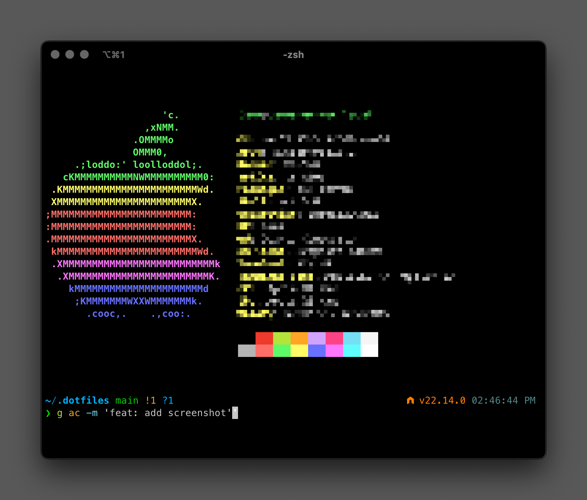

# 🛠️ macOS Dev Environment

A collection of dotfiles designed for a modern macOS development workflow. Features fast shell startup, intelligent command-line tools, and streamlined Git operations.


*Terminal: iTerm2 with MesloLGS NF font*

## 🚀 Features

### Modern CLI Tools
- [`eza`](https://github.com/eza-community/eza): A modern replacement for `ls` with Git integration
- [`bat`](https://github.com/sharkdp/bat): A `cat` clone with syntax highlighting
- [`ripgrep`](https://github.com/BurntSushi/ripgrep): Fast search tool (replacement for grep)
- [`fd`](https://github.com/sharkdp/fd): User-friendly alternative to `find`
- [`fzf`](https://github.com/junegunn/fzf): Fuzzy finder for files and history
- [`zoxide`](https://github.com/ajeetdsouza/zoxide): Smarter directory navigation that learns from your habits
- [`fnm`](https://github.com/Schniz/fnm): Fast Node.js version manager
- [`delta`](https://github.com/dandavison/delta): Better Git diff viewing

### Development Tools
- System monitoring with [`btop`](https://github.com/aristocratos/btop)
- HTTP requests with [`httpie`](https://github.com/httpie/httpie)
- Directory visualization with [`tree`](http://mama.indstate.edu/users/ice/tree/)
- Simplified man pages with [`tldr`](https://github.com/tldr-pages/tldr)

### Shell Features
- Fast shell startup with [Powerlevel10k](https://github.com/romkatv/powerlevel10k) instant prompt
- Syntax highlighting
- Command auto-suggestions
- Fuzzy completion
- Rich command history
- Directory jumping with zoxide

## 📦 Installation

```bash
# Clone the repository
git clone https://github.com/builtbylane/dotfiles.git ~/.dotfiles

# Run the installation script
cd ~/.dotfiles
./install.sh
```

The installation script will:
1. Create necessary symbolic links
2. Install [Homebrew](https://brew.sh) if not present
3. Install required packages
4. Set up [Zinit](https://github.com/zdharma-continuum/zinit) (Zsh plugin manager)
5. Configure private settings

## 🔒 Private Configuration

Two private configuration files are created during installation:

1. `~/.private_env.zsh`:
   - Store sensitive environment variables
   - Add personal aliases
   - Configure API keys
   - Add any machine-specific settings

2. `~/.gitconfig.private`:
   - Store Git credentials
   - Configure work-specific Git settings
   - Add private Git aliases

These files are git-ignored by default for security.

## 🔧 Handy Git Functions

### Quick Repository Navigation
```bash
# Open current GitHub repository in browser
gopen

# Open current branch's PR page
gpr

# Clone and CD in one command
gclonecd https://github.com/user/repo
```

### Branch Management

```bash
# Cleanup merged branches (protects important branches)
git cleanup

# Copy last commit message to clipboard
cl
```

### Modern Git Workflow
```bash
# Rebase current branch with latest main/master
git update

# Rebase current branch with any remote changes on current branch
git update-branch

# Squash commits for clean history
git squash

# Push with force-with-lease safety
git pub
```

Protected branches that won't be deleted: `main`, `master`, `develop`, `staging`, `prod`, `production`

## ⚡️ Shell Aliases

### Navigation
```bash
.. # cd ..
... # cd ../..
zi # Interactive zoxide navigation
cdf # cd to current Finder folder
```

### Modern Tool Replacements
```bash
ls → eza
cat → bat
find → fd
grep → rg
```

### Package Manager Shortcuts
```bash
r → npm run
yr → yarn run
br → bun run
pr → pnpm run
```

### Development
```bash
c → code .
dot → code ~/.dotfiles
```

## 🏗 Project Structure
```
.dotfiles/
├── install.sh          # Installation script
├── Brewfile            # Homebrew dependencies
├── .zshrc              # Main shell configuration
├── zsh/
│   ├── aliases.zsh     # Command aliases
│   ├── options.zsh     # Shell options
│   ├── paths.zsh       # PATH configuration
│   └── functions/
│       ├── git.zsh     # Git utilities
│       └── navigation.zsh # Navigation helpers
├── git/
│   ├── .gitconfig      # Git configuration
│   └── .gitignore      # Global gitignore
└── templates/
    ├── private_env.template
    └── gitconfig.private.template
```

## 🔄 Updating

```bash
# Pull latest changes
cd ~/.dotfiles
git pull

# Re-run installation script
./install.sh
```

The installation script is idempotent and can be run multiple times safely.

## 🛠 Customization

### Adding New Aliases
Add to `~/.private_env.zsh` for machine-specific aliases or `aliases.zsh` for shared ones.

### Adding New Functions
Place new function files in `zsh/functions/` - they'll be automatically loaded.

### Modifying Git Configuration
- Shared settings: Edit `.gitconfig`
- Private settings: Edit `.gitconfig.private`

## 📝 Notes

- Shell startup time is optimized through async loading
- Git configuration uses modern safety defaults
- All tools are configured for a dark terminal theme
- The shell history is configured for 100,000 entries
